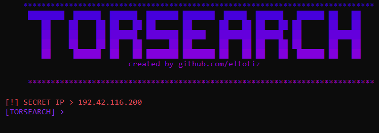

  
# ABOUT TOOL
TorSearch is a tool which would allow you to search the Deep Web using the Torch Search engine, all searches will be encrypted within the Tor network.

## Browser main menu

## How to use the tool!

    Commands:
        apt update
        apt install tor
        tor
    In another terminal:
       cd TorSearch
       python3 main.py

 

    Download Tor Browser for Windows
    Follow the following path of the executable in your "Tor Browser" folder:
    Tor Browser/Browser/TorBrowser/Tor/tor.exe
    Run tor.exe and open the terminal!

    cd TorSearch
    python main.py
or

    py main.py
## Warning!
Any misuse of the browser to purchase resources or consume illegal content will be the responsibility of the consumer.
